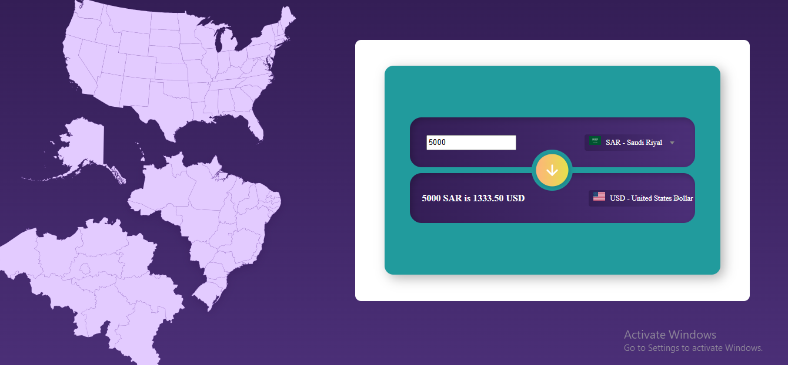

# 💱 Currency Exchange App

A web application that allows users to convert currencies using real-time exchange rates.

This project includes a frontend interface and a Node.js + Express backend server that securely handles API requests without exposing the API key.

## 📸 Preview

## 🌐 Features

- Real-time currency conversion
- Supports multiple currencies
- Backend proxy to protect the API key
- Clean and user-friendly interface
- Responsive design for different screen sizes

## 🛠️ Tech Stack

| Layer | Technology |
|---|---|
| Frontend | HTML, CSS, JavaScript |
| Backend | Node.js, Express |
| HTTP Client | Axios |
| API | ExchangeRate-API |

## 🏗️ Architecture

### Frontend

- Provides the user interface for currency conversion
- Sends requests to the backend server
- Displays exchange rate results

### Backend

- Built with Node.js and Express
- Receives requests from the frontend
- Communicates with ExchangeRate-API
- Keeps the API key hidden using `.env`
- Returns exchange rate data securely

## 🚀 How to Run Locally

1. Clone the repository:

git clone https://github.com/Arwa-AlAidaroos/currency_exchange.git

cd currency_exchange

2. Install dependencies:

npm install

3. Create a `.env` file in the project root and add your API key:

API_KEY=your_exchange_rate_api_key_here

4. Start the backend server:

node server.js

5. Open your browser and visit:

http://localhost:5000l

## 🔐 Backend Implementation

The backend works as a proxy between the frontend and ExchangeRate-API.

Instead of exposing the API key in the frontend, the server handles API requests securely:
